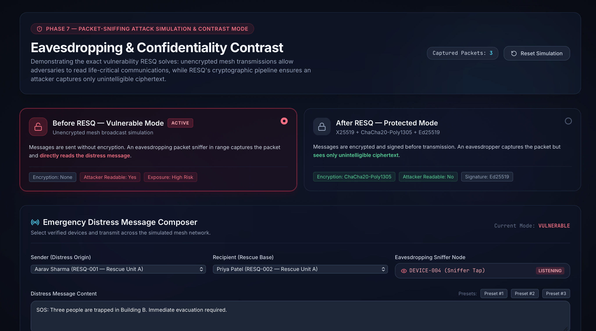
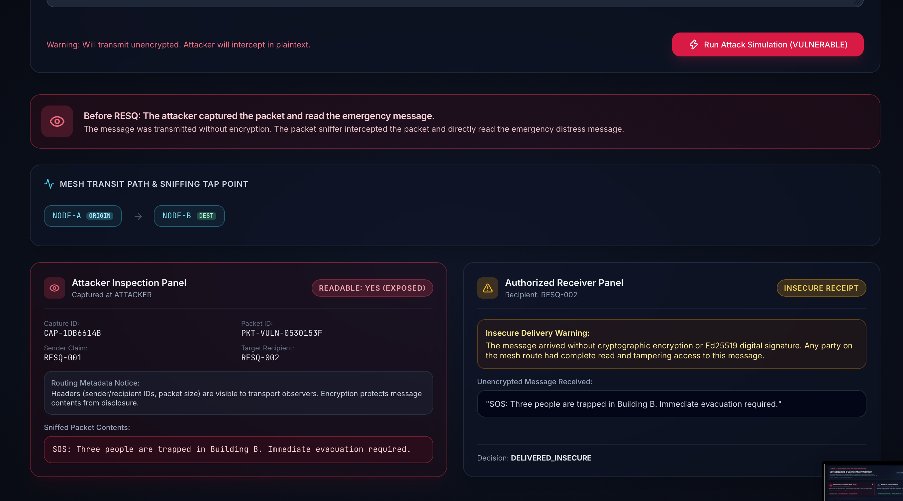
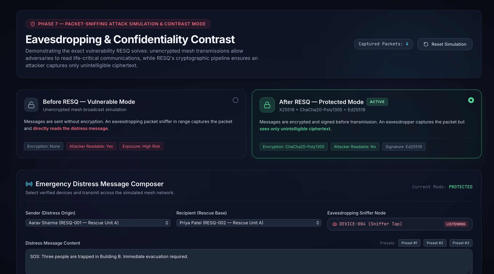
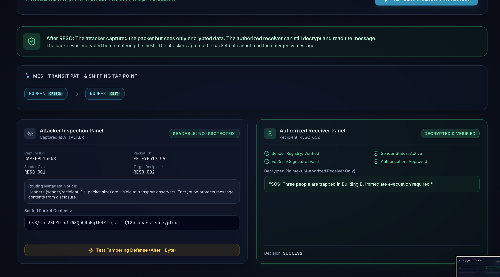
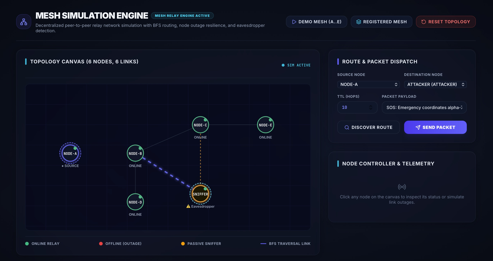
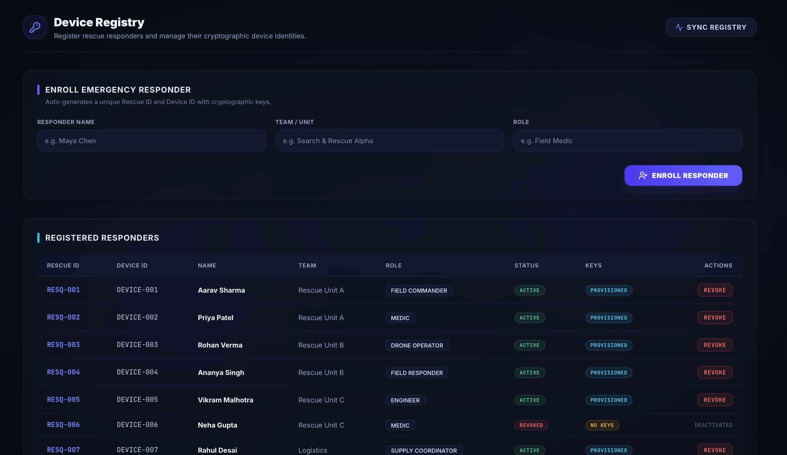

# 🛡️ RESQ — Zero-Trust Emergency Mesh Network & Tactical Communication

[](backend/app/services/crypto_service.py)
[](backend/)
[](frontend/)
[](backend/app/services/crypto_service.py)
[](tests/)
[](LICENSE)

> **Executive Summary for Judges:**  
> When blackouts, earthquakes, or conflicts take down cellular towers and internet backbones, first responders rely on ad-hoc wireless mesh relays. However, **traditional mesh networks broadcast plain unencrypted packets**, leaving life-critical coordinates and rescue plans vulnerable to sniffing, spoofing, and tampering.  
> **RESQ solves this with a military-grade Zero-Trust Mesh Architecture**: guaranteed **Zero Plaintext on the Wire**, authenticated sender identities via **Ed25519**, ephemeral forward secrecy via **X25519 ECDH + ChaCha20-Poly1305**, and a **Strict 6-Step Receiver Decryption Gate**.

---

## 📌 Table of Contents
- [🚨 The Problem & The Solution](#-the-problem--the-solution)
- [⚔️ Live Contrast Mode: Before vs After RESQ](#️-live-contrast-mode-before-vs-after-resq)
- [🖥️ Interactive System Walkthrough](#️-interactive-system-walkthrough)
  - [1. Mesh Simulation Engine](#1-mesh-simulation-engine)
  - [2. Secure Transmission Console](#2-secure-transmission-console)
  - [3. Trusted Rescue-Team Registry](#3-trusted-rescue-team-registry)
- [🛡️ The 6-Step Decryption Gate](#️-the-6-step-decryption-gate)
- [⚙️ Tech Stack & Cryptography Standards](#️-tech-stack--cryptography-standards)
- [🚀 Quick Start Guide (Run in 2 Minutes)](#-quick-start-guide-run-in-2-minutes)
- [🧪 Automated Verification & Test Suite](#-automated-verification--test-suite)
- [👥 Team InnovateX](#-team-innovatex)
- [📄 License](#-license)

---

## 🚨 The Problem & The Solution

| The Disaster Reality (Problem) | The RESQ Innovation (Solution) |
| :--- | :--- |
| **No Central Infrastructure:** Cellular and fiber networks are completely offline during disasters. Responders must use wireless peer-to-peer radio/Wi-Fi hops. | **Autonomous Dynamic Mesh:** Multi-hop BFS routing that dynamically routes packets through peer devices with TTL and outage resilience. |
| **Airwave Packet Sniffing:** Radio waves are broadcast in open air. Any nearby bad actor with cheap SDR/Wi-Fi hardware captures all transmitted packets. | **Zero Plaintext Wire Exposure:** Payloads are encrypted *before* entering the mesh. Captured packets reveal only high-entropy, unintelligible ciphertext. |
| **Impersonation & Rogue Relays:** Attackers can inject false coordinates, alter evacuation routes, or replay old distress calls. | **Cryptographic Identity & 6-Step Gate:** Every packet is signed with **Ed25519**, verified against a hardware registry, and checked for replays before decryption. |

---

## ⚔️ Live Contrast Mode: Before vs After RESQ

RESQ features a built-in **Side-by-Side Attack Simulator** that proves the security model live in front of the judges.

### ❌ 1. Before RESQ — Vulnerable Mode (Legacy Unencrypted Mesh)
*In standard mesh protocols, messages travel in cleartext over untrusted relays. An eavesdropper sniffs the airwaves and reads life-critical distress data immediately.*

<p align="center">
  
</p>
<p align="center">
  
</p>

- **Attacker Sniffer Panel:** Intercepts packet `PKT-VULN-0530153F` and directly reads:  
  `"SOS: Three people are trapped in Building B. Immediate evacuation required."`
- **Result:** ⚠️ **CRITICAL LEAK** — Target location and team identity exposed to adversaries.

---

### 🛡️ 2. After RESQ — Protected Mode (Zero-Trust Cryptographic Mesh)
*Every dispatch undergoes ephemeral X25519 key exchange, HKDF key derivation, ChaCha20-Poly1305 AEAD encryption, and Ed25519 signing before hitting the mesh.*

<p align="center">
  
</p>
<p align="center">
  
</p>

- **Attacker Sniffer Panel:** Captured packet displays **pure encrypted ciphertext** (`QsS/Tat2SCYQTx...`). Attacker cannot read a single character of the message.
- **Active Tamper Defense:** Clicking *"Test Tampering Defense (Alter 1 Byte)"* instantly invalidates the Poly1305 AEAD authentication tag and Ed25519 signature, causing the receiver gate to reject the packet.
- **Authorized Receiver Panel:** Only the verified keyholder (`RESQ-002`) successfully passes all 6 validation gates and decrypts the plaintext.

---

## 🖥️ Interactive System Walkthrough

### 1. Mesh Simulation Engine
Simulates a multi-hop ad-hoc wireless mesh topology with dynamic node states, link outages, and packet path tracing.

<p align="center">
  
</p>

- **Visual Canvas:** Real-time visual graph rendering relays (`NODE-A` through `NODE-E`) and active links.
- **BFS Shortest-Path Routing:** Automatically calculates optimal multi-hop transit routes with hop-by-hop forwarding and TTL counters.
- **Fault Injection & Outage Resilience:** Click any node to simulate hardware failure or battery depletion; mesh dynamically computes alternative paths.
- **Passive Sniffer Tap:** Shows real-time eavesdropping points monitoring passing traffic.

---

### 2. Secure Transmission Console
The command dashboard for field commanders and responders to dispatch distress signals and inspect wire packets.

<p align="center">
  
</p>

- **Authenticated Dispatcher:** Cryptographically signs dispatches with the sender’s private key (`Ed25519`) and encrypts targeting the recipient’s public key (`X25519`).
- **Wire Packet Inspector:** Inspects raw packets passing through transit nodes, confirming **Zero Plaintext on Wire**.
- **Recipient Device Inbox & Gate Inspector:** Live step-by-step verification readout showing the status of each security checkpoint upon packet arrival.

---

### 3. Trusted Rescue-Team Registry
The public-key infrastructure (PKI) and cryptographic device authority.

<p align="center">
  
</p>

- **Responder Enrollment:** Onboard field units with auto-generated unique `Rescue ID` (e.g., `RESQ-001`) and hardware `Device ID`.
- **Cryptographic Key Provisioning:** Generates and associates public signing (`Ed25519`) and encryption (`X25519`) keys.
- **Instant Revocation:** Compromised or captured devices can be revoked in one click. Revoked nodes are instantly blocked by the decryption gate across the entire network.

---

## 🛡️ The 6-Step Decryption Gate

In RESQ, receiving a packet **never** automatically exposes data. A packet must pass six sequential cryptographic gates before the receiver's hardware decrypts the emergency payload:

```
                  ┌──────────────────────────────┐
                  │   Incoming Mesh Wire Packet   │
                  └──────────────┬───────────────┘
                                 │
                                 ▼
         ┌────────────────────────────────────────────────┐
         │ Gate 1: Sender Registry Lookup                 │──► [Fail: Unknown ID]   ──► REJECT
         └───────────────────────┬────────────────────────┘
                                 │ Pass
                                 ▼
         ┌────────────────────────────────────────────────┐
         │ Gate 2: Sender Status Validation               │──► [Fail: Revoked Unit] ──► REJECT
         └───────────────────────┬────────────────────────┘
                                 │ Pass
                                 ▼
         ┌────────────────────────────────────────────────┐
         │ Gate 3: RFC 8785 Ed25519 Signature Check       │──► [Fail: Tampered Wire]──► REJECT
         └───────────────────────┬────────────────────────┘
                                 │ Pass
                                 ▼
         ┌────────────────────────────────────────────────┐
         │ Gate 4: Recipient Hardware Authorization       │──► [Fail: Wrong Target] ──► REJECT
         └───────────────────────┬────────────────────────┘
                                 │ Pass
                                 ▼
         ┌────────────────────────────────────────────────┐
         │ Gate 5: Replay Attack Defense (Packet ID/TTL)  │──► [Fail: Duplicate ID] ──► REJECT
         └───────────────────────┬────────────────────────┘
                                 │ Pass
                                 ▼
         ┌────────────────────────────────────────────────┐
         │ Gate 6: ChaCha20-Poly1305 AEAD Decryption      │──► [Fail: Corrupt Tag]  ──► REJECT
         └───────────────────────┬────────────────────────┘
                                 │ Pass
                                 ▼
                  ┌──────────────────────────────┐
                  │ Plaintext Released to Unit   │
                  └──────────────────────────────┘
```

---

## ⚙️ Tech Stack & Cryptography Standards

### Frontend
- **Framework:** React 18 + Vite + TypeScript
- **Styling & UI:** Tailwind CSS (Dark tactical theme with cyber-ops telemetry styling)
- **Icons & Visuals:** Lucide React + HTML5 Interactive Canvas

### Backend
- **Framework:** FastAPI (Python 3.10+)
- **Validation:** Pydantic v2 schemas
- **Architecture:** Modular clean architecture (Routers, Services, Repositories, Domain models)

### Cryptographic Primitives
- **Digital Signatures:** `Ed25519` (RFC 8032) for high-speed, collision-resistant message authenticity.
- **Key Exchange:** Ephemeral `X25519` (ECDH) ensuring Perfect Forward Secrecy per packet.
- **Key Derivation:** `HKDF-SHA256` with 16-byte random salts.
- **Authenticated Encryption:** `ChaCha20-Poly1305` (AEAD, RFC 8439) with random 12-byte nonces.
- **Canonical Serialization:** `RFC 8785` (JSON Canonicalization Scheme) to ensure immutable signature hashing.

---

## 🚀 Quick Start Guide (Run in 2 Minutes)

### Prerequisites
- **Python 3.10+**
- **Node.js 18+ & npm**

### 1. Start Backend API
```bash
# From repository root:
uvicorn backend.app.main:app --host 127.0.0.1 --port 8000 --reload
```
*API Swagger documentation will be available at:* **`http://127.0.0.1:8000/docs`**

### 2. Start Tactical Frontend
```bash
# In a new terminal window:
cd frontend
npm install
npm run dev
```
*Open your browser at:* **`http://localhost:5173`**

---

## 🧪 Automated Verification & Test Suite

Run the standalone verification scripts and automated tests to evaluate correctness without opening the browser:

```bash
# 1. Run End-to-End Encryption & 6-Step Gate Verification
python3 verify_phase6.py

# 2. Run Packet Sniffing & Attack Simulation Verification
python3 verify_phase7.py

# 3. Run Full Automated Test Suite (Pytest)
pytest tests/ -v
```

---

## 👥 Team InnovateX

| Name | Role |
| :--- | :--- |
| **Krish Anand** | Team Leader |
| **Abhinav Puri** | Team Member |
| **Debojit Deb** | Team Member |
| **Shreya Singh** | Team Member |

---

## 📄 License

This project is licensed under the MIT License — see the [LICENSE](LICENSE) file for details.

---

<p align="center">
  <b>RESQ</b> · Built with ❤️ for <b>Tech Adrishta 26</b> by <b>Team InnovateX, SMIT</b>.
</p>